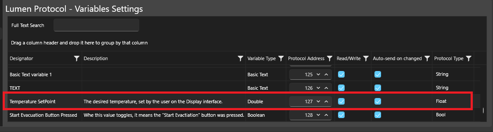
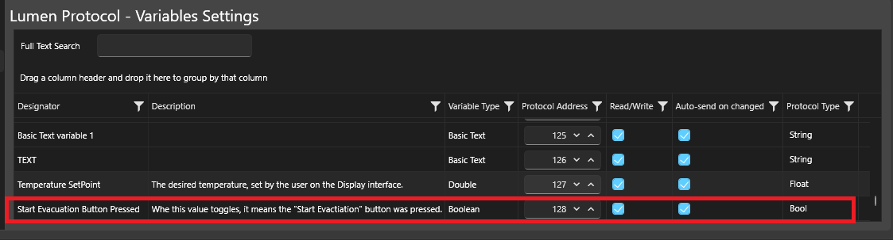

# About the Lumen Protocol library
The Lumen Protocol library makes it very easy to establish serial communication between any microcontroller and your Smart + Display!

It is written in C, so it is compatible with any MCU architecture from any manufacturer (PIC, ARM, ATMega, STM, etc.)!

> Most examples in this documentation are written for Arduino, but you can use on absolutely any microcontroller with a UART port.

To make things even easier, you can export all the variable definitions directly from your UnicView Studio project!

# Getting Started

## C library setup

1. Include the files from [C Library Directory](src/c) (`LumenProtocol.c`, `LumenProtocol.h` and `LumenProtocolConfiguration.h`) into your project and reference [LumenProtocol.h](src/c/LumenProtocol.h):

``` cpp
#include "LumenProtocol.h"
```

2. Provide your platform-specific implementation of `lumen_write_bytes` and `lumen_get_byte` functions:

``` cpp
#include "LumenProtocol.h"

extern "C" void lumen_write_bytes(uint8_t *data, uint32_t length) {
  Serial.write(data, length);
}

extern "C" uint16_t lumen_get_byte() {
  if (Serial.available()) {
    return Serial.read();
  }
  return DATA_NULL;
}

lumen_packet_t *currentPacket;
```

## Communication setup

1. Copy the variable definitions from UnicView Studio:

``` cpp
#include "LumenProtocol.h"

extern "C" void lumen_write_bytes(uint8_t *data, uint32_t length) {
  Serial.write(data, length);
}

extern "C" uint16_t lumen_get_byte() {
  if (Serial.available()) {
    return Serial.read();
  }
  return DATA_NULL;
}

lumen_packet_t *currentPacket;

// User Variable Address
const uint16_t engine_temperature_setpointAddress = 121;
const uint16_t fire_alarm_statusAddress = 122;

// User Variable Packets
lumen_packet_t engine_temperature_setpointPacket = { engine_temperature_setpointAddress, kS32 };
lumen_packet_t fire_alarm_statusPacket = { fire_alarm_statusAddress, kBool };
```

2. Implement reception and transmission logic according to your application:

``` cpp
#include "LumenProtocol.h"

extern "C" void lumen_write_bytes(uint8_t *data, uint32_t length) {
  Serial.write(data, length);
}

extern "C" uint16_t lumen_get_byte() {
  if (Serial.available()) {
    return Serial.read();
  }
  return DATA_NULL;
}

lumen_packet_t *currentPacket;

// User Variable Address
const uint16_t engine_temperature_setpointAddress = 121;
const uint16_t fire_alarm_statusAddress = 122;

// User Variable Packets
lumen_packet_t engine_temperature_setpointPacket = { engine_temperature_setpointAddress, kS32 };
lumen_packet_t fire_alarm_statusPacket = { fire_alarm_statusAddress, kBool };

void setup() {
  delay(1000);
  Serial.begin(115200);
}

void loop() {

  // Display data reception logic:
  while (lumen_available() > 0) {
    currentPacket = lumen_get_first_packet();

    if (currentPacket != NULL) {

      // Checking if currentPacket is from fire_alarm_status
      if (currentPacket->address == fire_alarm_statusAddress) {
        bool isFireAlarmOn = currentPacket->data._bool;

        if (isFireAlarmOn == true) {
          // Alarm on! Set temperature set point to 20°C
          engine_temperature_setpointPacket->data._s32 = 20;
        }

        // Send the new value (20) to the Display
        lumen_write_packet(&engine_temperature_setpointPacket);
      }

    }
  }

  // Other application logic goes here 👇

}
```

# Functions
--- Section under construction 🛠 ---

## Function to edit 'basic text list' and 'integer list' variables:

``` cpp
uint32_t lumen_write_variable_list(uint16_t address, uint16_t index, uint8_t *data, uint32_t length);

// Usage example:
// Change the text at index 7 of a 'basic text list' variable at address 125 to "New Text".
lumen_write_variable_list(125, 7, "New Text", 9);
```

# Usage examples
See all usage examples in the [Examples Directory](./examples).

You can also try our official demo projects at:

- https://www.proculustech.com/unicview-studio-demo-projects/
- https://victorvision.com.br/suporte/unicview-studio-projetos-demo/

## Sending values to the Display


## Receiving values from the Display from user input {#receiving-input}
``` cpp
// Variable packet declaration:
const uint16_t temperature_setpointAddress = 127;
lumen_packet_t temperature_setpointPacket = { temperature_setpointAddress, kFloat };


// Somewhere in your main loop:
while (lumen_available() > 0) { // While there are new unread packets
  currentPacket = lumen_get_first_packet(); // Gets the oldest unread packet
  if (currentPacket != NULL) { // Checks if the packet is valid

    if (currentPacket->address == temperature_setpointAddress) { // Checks the packet address, and only process it if it is from the correct variable
      float temperatureSetPoint = currentPacket->data._float; // Gets the packet value and stores it for further usage

      // Do something with 'temperatureSetPoint'
    }
  }
}
```

Notice the settings from UnicView Studio:


## Detecting button events
There is no concept of "button events" per se in the communication structure. To detect button events, you need to make the button modify some variable that represents the event.

In other words, you don't receive nor react to touch events on the Display, you receive changes in the values of the variables, and you react to those value changes.

This is exactly the same idea from the ["Receiving values"](#receiving-input) example.

Example:

``` cpp
// Variable packet declaration:
const uint16_t start_evacuation_button_pressedAddress = 128;
lumen_packet_t start_evacuation_button_pressedPacket = { start_evacuation_button_pressedAddress, kBool };


// Somewhere in your main loop:
while (lumen_available() > 0) { // While there are new unread packets
  currentPacket = lumen_get_first_packet(); // Gets the oldest unread packet
  if (currentPacket != NULL) { // Checks if the packet is valid

    if (currentPacket->address == start_evacuation_button_pressedAddress) {
      // We don't nee to get the value, since when this button changes the value to any value, it signals
      // we should start the evacuation.
      // So, here goes the evacuation logic 👇.
    }
  }
}
```

Notice the settings from UnicView Studio:


## Sending text to the Display (write string)
``` cpp
// Variable packet declaration:
const uint16_t statusTextAddress = 123;
lumen_packet_t statusTextPacket = { statusTextAddress, kString };


// Somewhere in your main loop:
char *text = "All is fine";

if (temperature > 30) {
  text = "CAUTION! Overheating, lower temperature now!";
}
if (temperature > 70) {
  text = "WARNING! Meltdown in progress. EVACUATE IMMEDIATELY";
}

uint32_t textLength = strlen(text) + 1;
lumen_write(statusTextAddress, text, textLength);
```

## Updating the Display Project by UART (using ESP32 WiFi)
This repository contains a demonstration project showcasing how to transfer a compiled UnicView Studio project to a display via serial communication using the Lumen Protocol library: https://github.com/victorvision/serial-project-transfer-demo

## Basic Display Project update by UART
See this example project for a basic implementation of Project update by UART: [project_transfer_demo_c](./examples/project_transfer_demo_c).
