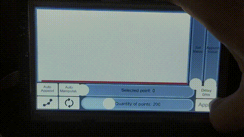
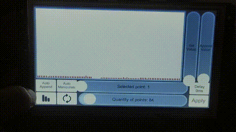
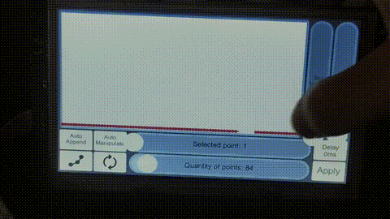
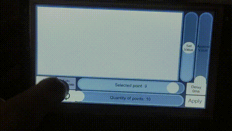

# Chart Demo

This project demonstrates most chart operations currently available.

You can use the Arduino sketch as example on how to control the chart and send data correctly for each configuration.

Data can be sent by the microcontroller or by user input by touching on the `Append Value` slider or the `Selected point` and `Set Value` sliders.

Note: The Arduino sketch stores all the 800 points in memory to be able to manipulate them, so the memory usage is very high. Most projects don't need to do this.

## Modes

- Shift: New points are always plotted on the right-most position.
- Cyclic: New points are plotted left-to-right. When they reach the right-most position, they go back to the left side.

## Types

- Line: Points are connected by straight lines. Dots on each point are optional.
- Bar: Points represent the height of a fixed-width vertical bar.

## Input Methods

- Append: Adds a new value to the chart, on the last position.
- Set Value: Modifies an existing value on the chart, based on an arbitrary X position.

## Examples

Mode: Cyclic | Type: Line | Input Method: Append

Mode: Cyclic | Type: Bar | Input Method: Append

Mode: Cyclic and Shift | Type: Line | Input Method: Append

Mode: Any | Type: Bar | Input Method: Set Value

Full demonstration

